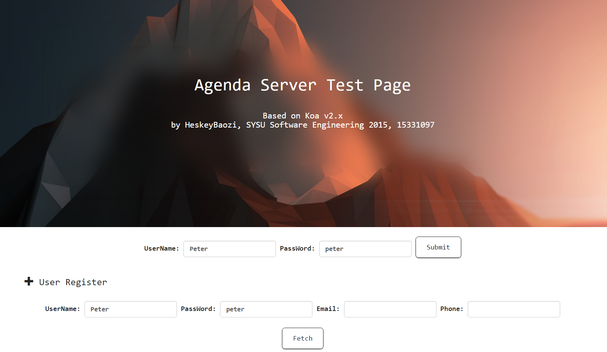

# Agenda-Server

a simple Agenda server based on [Koa v2.x](http://koajs.com/), and [a homework project for 2015 train, SYSU](http://my.ss.sysu.edu.cn/wiki/pages/viewpage.action?pageId=519471162).

## outlook



## Quick Start

-  git clone
```bash
git clone https://github.com/HeskeyBaozi/agenda-server.git
cd agenda-server
```

-  install dependencies
```bash
npm install
```

-  run the server [http://localhost:3000](http://localhost:3000)
```
npm start
```

## License
[MIT](./LICENSE)